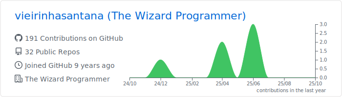
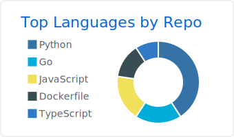
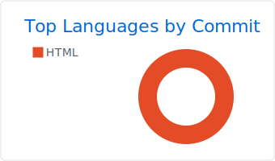

<h1> Hello World ! </h1>

### I'm a 🇫🇷 Software Engineer living in 🇧🇷 and working at [BTG Pactual](https://www.btg.com/).

### Languages & Tools 🛠

    &nbsp;

   &nbsp;

        &nbsp;

    &nbsp;

### Analytics ⚙️
  

  
  

  
  

<!-- 

 -->

<!-- 

  
  
  

 -->

<!--  -->
<!--  -->

### Let's connect ? 🤝

### Customize your README profile 🧑‍💻⭐

#### 👉   _[Statistics](https://github.com/anuraghazra/github-readme-stats) ➕  [Summary Cards](https://github.com/vn7n24fzkq/github-profile-summary-cards) ➕  [Snake animation](https://github.com/Platane/snk) ➕  [Metrics](https://github.com/marketplace/actions/metrics-embed)_

#### 👉   _[STEP by STEP to create a similar README profile](https://bit.ly/devtoritgithubcreateprofile)_

#### ... or fork this repository! 😁
